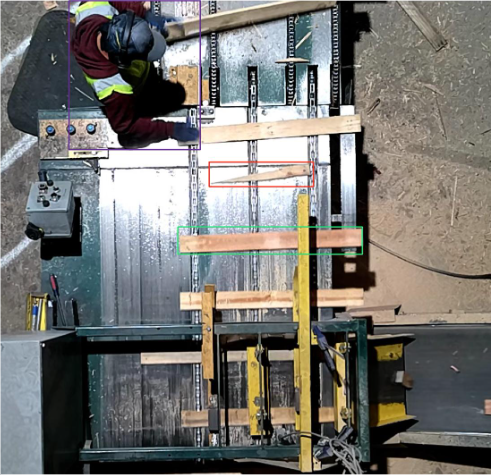
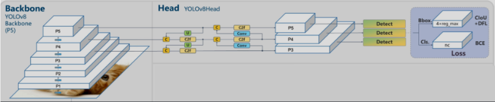
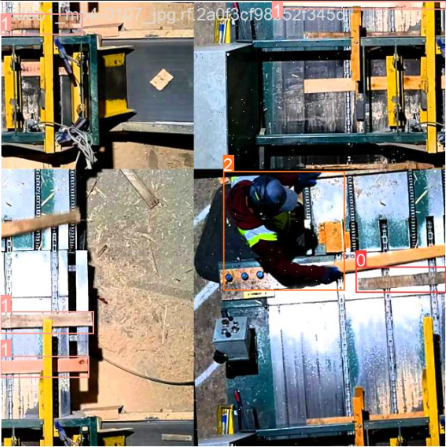
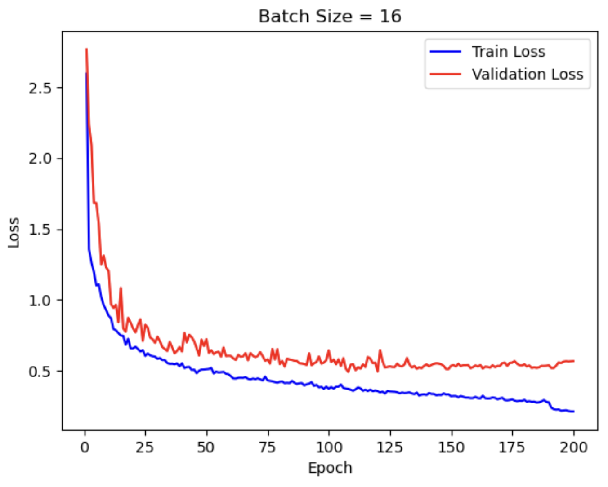
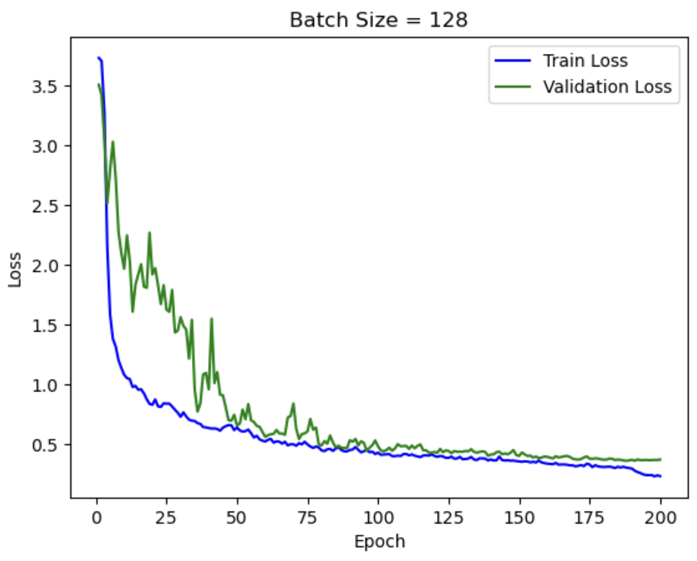
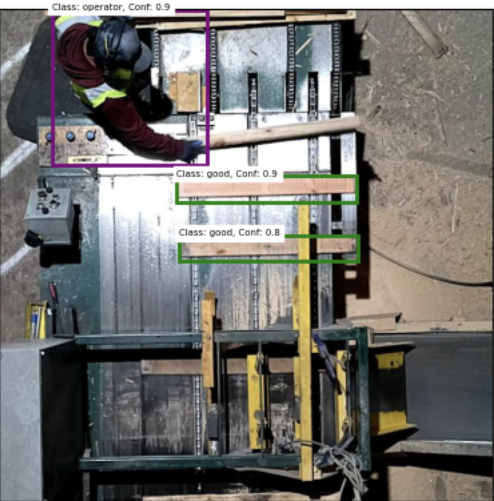
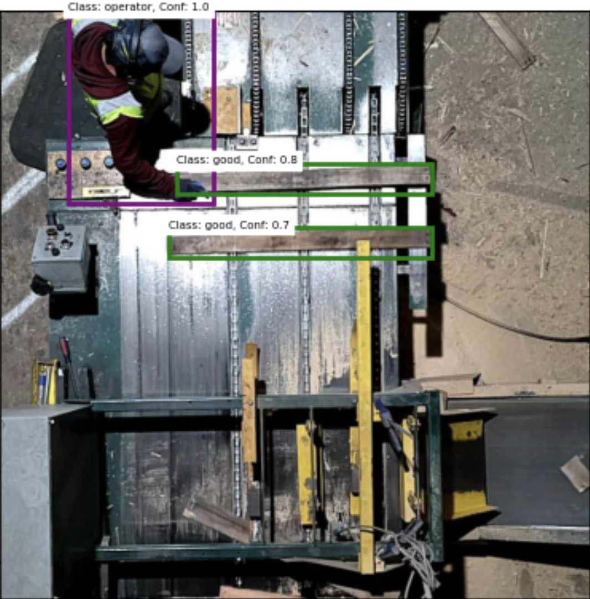
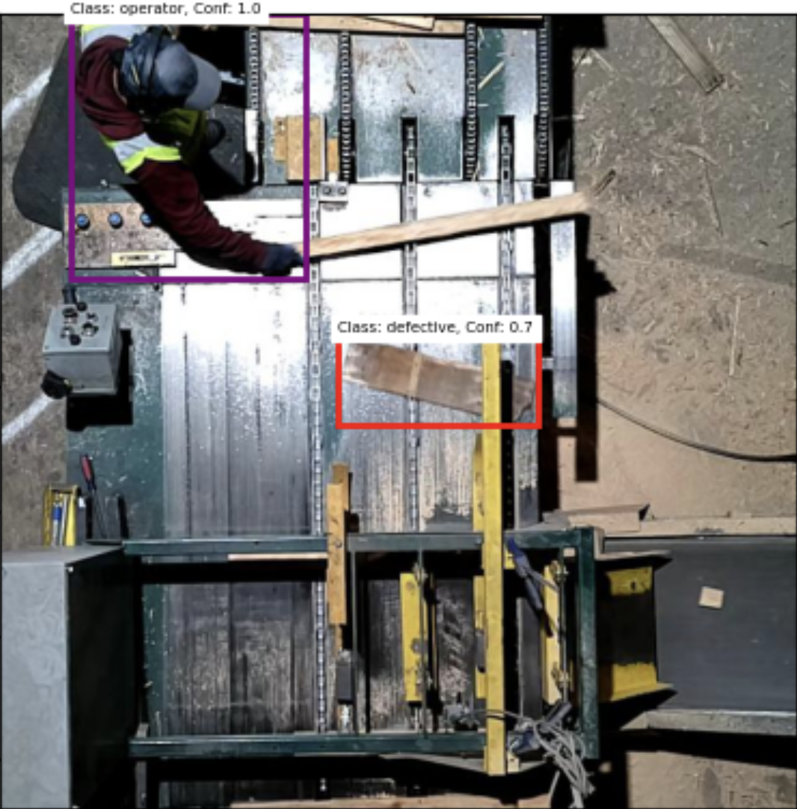
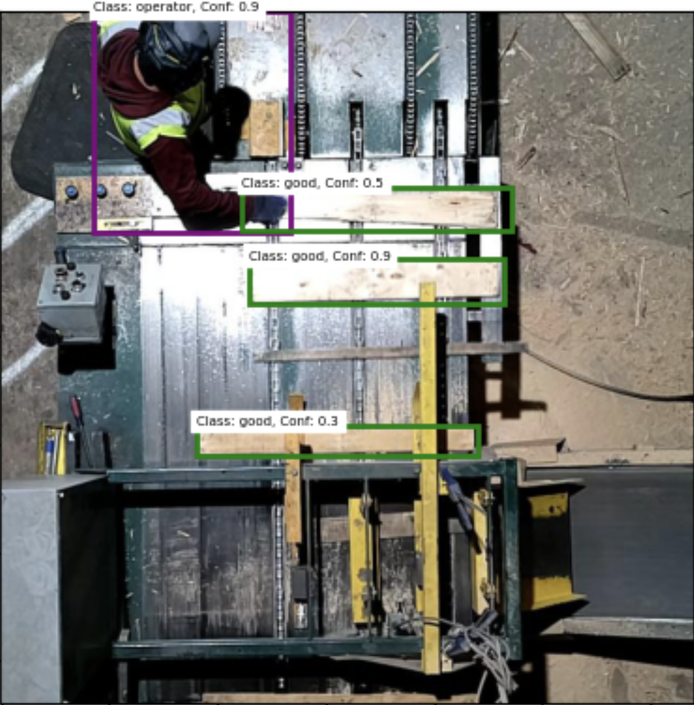

# Lumber Quality Control with Computer Vision

## Problem Statement
In today's modern world of optimization and technology, industrial factories are finding ways to optimize efficiency and yield as well as integrating automation in their factories. One specific industry is the lumber industry. Companies in the lumber industry desire the ability to automate the tracking of how much wood they process, the quality of the wood they are processing, and efficiency of their workers. A finely tuned computer vision model in conjunction with cameras will sooth this desire. This project will train a convolutional neural network (CNN) which detects, tracks, and records the quality of wood being processed on a production line as well as tracking the operator. In the industry this will be implemented on a live feed, but for the sake of this project, images and a video of the production line will be used to prove the models accuracy and effectiveness.

## Data Source
I have collected a video, approximately 1 minute in length, of a production line at a lumber processing factory. Using Roboflow, I cut this video into 190 images, and began annotating objects which the model will be trained to detect. The model will be trained to detect three classes, “good”, “defective”, and “operator”. As the names suggest, a “good” board is acceptable by the factory, a “defective” board isn’t acceptable, and “operator” is the operator.

The image on the above is an annotated image from the dataset. The operator is bounded in purple, the defective board in red, and the good board in green. 

Following annotation, utilizing roboflow, I added an additional 211 images, by introducing augmentations, 459 in total in the dataset. These augmentations include rotation, exposure, blur, and noise. Augmentations are beneficial because they add more images for the model to be trained, and introduce more variance which benefits the model’s performance. For example, this video was filmed at height of the day with glaring sun; in the early morning or late afternoon the model may not be able to detect the desired object in darker conditions. In this scenario, including exposure into the dataset is beneficial because the model will now know how to detect in darker environments. Blur is beneficial in the case where an external factor causes the camera view to become blurry, and noise where dust or other particles interrupt the camera’s view. Rotation is added so the model learns how to detect in the case where boards are angled, etc. Ultimately these augmentations expose the model to different scenarios which are beneficial in practical use. Finally, the data is split into train, validate, and test sets for the modeling process. 

## Methodology
Convolutional neural networks are a class of neural networks which specialize in processing data which have grid-like topology, such as images. A CNN consists of three layers, a convolutional layer, pooling layer, and a fully connected layer. The beginning layers detect simple patterns like lines and curves while the layers at the end detect complex patterns like faces & objects–boards & operators in this case. More specifically, the convolutional layer performs a dot product between a matrix which is a set of learnable parameters, aka the kernel, and a matrix which represents a portion of the image. Since convolution is a linear operation, at the end of each convolutional layer a nonlinear activation function (ReLU, Sigmoid, etc.) is applied. The non-linearity gives a deep neural network the ability to learn very complex functions of the input. The pooling layer reduces the dimension and required computation of the output by using summary statistics (max, mean) to represent a given pool. Finally, the fully connected layer maps the representation between the input and the output–making a prediction. 

The base of my model is a CNN, more specifically YOLOv8 (You Only Look Once), a computer vision model designed by Ultralytics. YOLOv8 comes pre-trained with object detection, classification, and segmentation tasks capabilities. YOLOv8 is trained on a dataset similar to COCO (Common Objects in Context) which includes a broad range of images providing a strong foundation for fine tuning. YOLOv8 has several different sizes, Extra Large, Large, Medium, Small, and Nano. The larger models are heavier, require more training time, and are more precise, while the smaller models are lighter, take less time to train but they lose out on some precision. Since this application is for real time detection where speed is a priority, the nano model will be used. The architecture of YOLOv8 consists of a backbone and the head; the backbone is composed of 53 convolutional layers and the head is composed of multiple convolutional layers followed by fully connected layers. On a high level, this model divides images into a grid system, patterns/objects are detected within each grid, and then a detection over the entire image is produced. The dataset described previously will be used to tune YOLOv8 and derive a specialized model for detecting and tracking operators and boards in lumber factory’s production line. A visualization of YOLOv8’s architecture:

An interesting (optional) feature YOLOv8 has is 
mosaic augmentation. This is where four images are placed together as one image (example below) which makes the network learn different locations of where objects are.

## Hyperparameters
Two important hyperparameters when tuning a deep neural network model are batch size and epochs. An epoch represents the training set being fed into the model one time. One epoch means the model has worked through the data once, 70 epochs means the model has worked through the data 70 times, and so forth. Depending on the batch size it can take many batches, or even just 1 batch to complete 1 epoch. From my experience tuning CV models, 200 epochs 
is generally a good range for the model to reach its optimal weights, thus my models were trained for 200 epochs. YOLOv8 takes a weighted average of mAP50 and mAP50-95 of the current weights at each epoch to select the best model. mAP50 is the mean average precision when detecting objects using a confidence threshold of 0.5, similarly for mAP50-95 with varying thresholds between 0.5-0.95.

In short, batch size is the number of samples the model is trained on before updating its weights and repeats until it has gone through all the samples. A small batch size updates the model parameters (using mini-batch Gradient Descent) more frequently while a large batch size will update its parameters much less. Small batches introduce noise which is beneficial to avoid overfitting. That said, a batch size of 1 sample is generally not optimal, thus finding a sweet spot is necessary. 

## Training Results
I tuned the model 4 different times, each with 200 epochs and the following batch sizes: 4, 16, 64, 128, to compare their performance and select the best weights for testing. 

 Best Model Metrics by Batch Size

| Batch Size | Epoch of Best Weights | Precision | Recall | mAP50 | mAP50-95 | Validation Loss |
|------------|-----------------------|-----------|--------|-------|----------|-----------------|
| 4          | 190                   | 0.91142   | 0.98701| 0.98139| 0.88979  | 0.37285         |
| 16         | 185                   | 0.95936   | 0.98736| 0.97898| 0.9077   | 0.52398         |
| 64         | 151                   | 0.9521    | 0.98931| 0.98012| 0.88247  | 0.37694         |
| 128        | 196                   | 0.93496   | 0.98324| 0.97565| 0.88329  | 0.36440         |

A batch size of 16 resulted in the highest precision, recall, and validation loss scores. But unfortunately a high validation loss is not desired, this means the weights had more errors when testing on the validation set. The validation set contains data which is not in the training set thus the goal is to perform well on the validation set. I selected the best weights based on validation loss and performance on the test set which are more important metrics for my application. The weights with a batch size of 128 have the lowest validation loss and the best detection on images it hasn’t seen before. 

|||
|:-:|:-:|
|||

Visually investigating the train and validation loss for batch sizes of 16 and 128, it is apparent the weights with a batch size 16 were overfitted. Overfitting occurs when the model is trained too precisely on the training data, and performs poorly on the validation and test sets, which means the model does not generalize well. Overfitting is portrayed by the increasing gap between the red (validation loss) and blue (train loss) in the image above on the left. This gap indicates the model is performing increasingly better on the training set, but stopped improving on the validation set. The image above on the right is the train/validation loss of the model with a batch size of 128 where the gap is initially large and then converges to a point where the train and validation loss are nearly the same–the ideal scenario. 
    

## Evaluation and Final Results
After selecting the optimal weights, I used them to detect and classify objects in images from the test set. All around the model performed very well, detecting and classifying nearly all objects correctly. Below are four images from the test set, the operator in purple, the good boards in green, and the defective in red. Looking closely at the fourth image on the bottom right, there is a gray thin board which was not detected. The model may have missed this object because a board this thin wasn’t in the training data, and since it is darker than most boards and is blending in with the platform–making it harder for the model to differentiate. This inaccuracy can be improved by including more images with thin boards in the training set.

|||
|:-:|:-:|
|||

|||
|:-:|:-:|
|||

In addition to testing the model on the test set, I tested on a video available [here](https://www.youtube.com/shorts/nXIx9iLexUE) and at “Video Detections/test_detect.mp4”. The model successfully detected and classified every board/operator in the video.

## Conclusion
This project demonstrates the potential of computer vision technology, specifically convolutional neural networks (CNNs), to address key challenges faced by the lumber industry in tracking and optimizing their production processes. By leveraging a finely tuned CNN model, trained on annotated images and videos of lumber production lines, the project aims to automate detection and classification of wood quality and operator efficiency.

Through data collection, annotation, and augmentations, a varied dataset was created to tune the YOLOv8 model. The methodology involved selecting appropriate hyperparameters, such as batch size and epochs, to optimize model performance. Evaluations revealed that a batch size of 128 yielded the most promising results, minimizing validation loss and indicating superior performance on unseen data.

Testing on both image datasets and real-world video footage showcased the model's effectiveness in accurately detecting and classifying objects, with minimal inaccuracies. While some challenges were encountered, such as the detection of thin boards, further refinement of the training dataset could address such limitations.

Looking ahead, the potential applications of this technology in live production environments are significant. Real-time detection and data recording capabilities would enable lumber companies to make informed decisions, optimize processes, and enhance overall efficiency. By leveraging insights derived from the model's output, companies can identify areas for improvement, increase productivity, and reduce reliance on manual data collection methods.

## References
Keylabs. (2024, February 27). Under the hood: YOLOV8 architecture explained. Keylabs: Latest News and Updates. https://keylabs.ai/blog/under-the-hood-yolov8-architecture-explained/

Mehra, A. (2023, October 8). Understanding YOLOv8 Architecture, Applications & Features. Labellerr. https://www.labellerr.com/blog/understanding-yolov8-architecture-applications-features/

Vk. (2023, November 22). YoloV8 Architecture & Cow counter with region based dragging using YoloV8. Medium.https://medium.com/@VK_Venkatkumar/yolov8-architecture-cow-counter-with-region-based-dragging-using-yolov8-e75b3ac71ed8

Mishra, M. (2021, December 15). Convolutional neural networks, explained - towards data science. Medium. https://towardsdatascience.com/convolutional-neural-networks-explained-9cc5188c4939

Datum Learning. (2023, January 26). Video object detection using Yolov8 CLI | object detection in video using Google Colab [Video]. YouTube. https://www.youtube.com/watch?v=Rwvd0PJF2jk

Shen, K. (2018a, June 19). Effect of batch size on training dynamics. Medium. https://medium.com/mini-distill/effect-of-batch-size-on-training-dynamics-21c14f7a716e

Ultralytics. (2024, March 2). Yolo Performance Metrics. YOLO Performance Metrics - Ultralytics YOLOv8 Docs. https://docs.ultralytics.com/guides/yolo-performance-metrics/#object-detection-metrics

Brownlee, J. (2022, August 15). Difference between a batch and an epoch in a neural network. https://machinelearningmastery.com/difference-between-a-batch-and-an-epoch/
